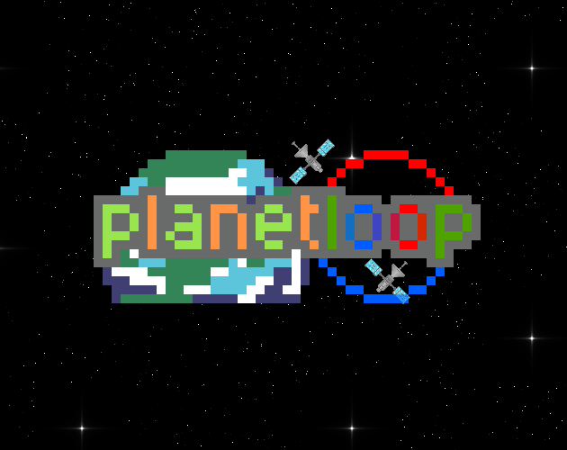

# 🪐 Planet Loop

> **Shoot. Orbit. Loop. Repeat.**

**Planet Loop** is a small physics-based space game made in **Godot** for **GMTK Game Jam 2025**.

You control a satellite launched through space by aiming and charging a shot with your mouse. Your goal is to use planetary gravity to complete a **full rotation around each planet**.

Complete an orbit and the planet disappears. Miss your trajectory and crash into the planet? **You reset back to your starting position and try again.**

I wasn't able to submit the game before the GMTK Game Jam deadline, but I decided to keep the project as a playable prototype and experiment with orbital physics and game mechanics.

---

## 🎮 Gameplay

The core gameplay is simple:

**Aim → Launch → Orbit → Destroy → Repeat**

You start next to a planet with your satellite ready to launch.

Use the mouse to choose your launch direction and strength. Once launched, the satellite travels freely through space while being affected by the planet's gravity.

Your objective is to make the satellite travel **one complete loop around the planet**.

### 🪐 Complete an Orbit

Successfully make one full rotation around the planet and the planet is destroyed/disappears.

The satellite then returns to a state where you can launch it again toward the next planet.

### 💥 Crash into the Planet

Things don't always go according to plan.

If the satellite crashes directly into the planet, the attempt fails and the satellite **resets to its original position**, allowing you to try the shot again.

The challenge is finding the right combination of **angle and launch strength** to produce a successful orbit.

---

## 🕹️ Controls

| Input                   | Action                                    |
| ----------------------- | ----------------------------------------- |
| 🖱️ Mouse position      | Aim the satellite                         |
| ↔️ Mouse distance       | Determines launch strength                |
| 🖱️ Mouse click/release | Launch the satellite                      |
| 💥 Crash                | Satellite resets to its starting position |

The farther you pull the mouse away from the satellite, the stronger the launch.

---

## 🎯 Objective

For every planet:

1. Aim the satellite.
2. Choose your launch strength.
3. Launch the satellite.
4. Use the planet's gravity to enter an orbit.
5. Complete **one full rotation**.
6. The planet disappears.
7. Move on to the next planet.

If you crash into the planet, **your satellite resets and you can try again**.

The goal is to figure out the physics and learn how to make the perfect shot.

---

## ✨ Features

* 🛰️ Physics-based satellite movement
* 🪐 Planetary gravity
* 🖱️ Mouse-based aiming system
* 💪 Distance-based launch strength
* 🔄 Orbital gameplay
* 💥 Planet destruction after completing an orbit
* ♻️ Satellite reset after crashing
* 🌌 Simple space-themed environment
* 🎯 Skill-based trajectory planning

---

## 🎬 Gameplay

> **Add a gameplay GIF here!**

A short gameplay GIF is recommended here so visitors can immediately understand the game without having to download it.

```markdown

```

You can replace the path above with wherever you store your GIF.

### 📸 Screenshots

> Add screenshots of the game here.

```markdown


```

---

## 🚀 Play the Game

Play it now on Itch!

**[▶️ Download / Play Planet Loop](https://revarsel.itch.io/planet-loop)**

---

## 🚧 Future Improvements

Planet Loop is currently a small game, but I will be working on it time to time.

Plan on adding more levels, features, etc in the future.

---

<p align="center">
  🛰️ <b>Planet Loop</b><br>
  <i>Shoot. Orbit. Loop. Repeat.</i>
</p>

<p align="center">
  Made with ❤️ and Godot
</p>
